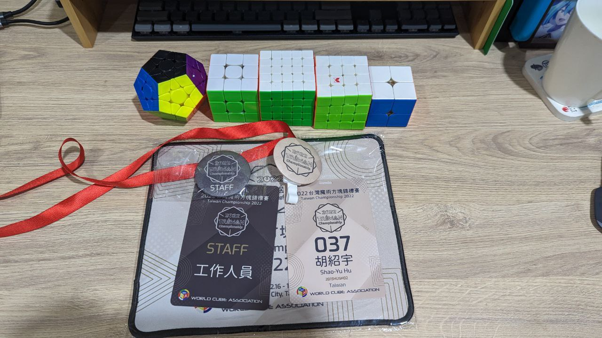
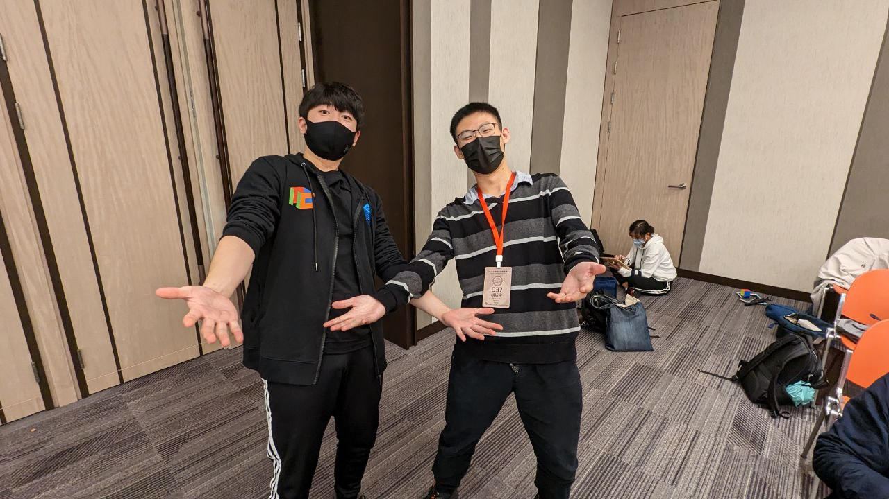
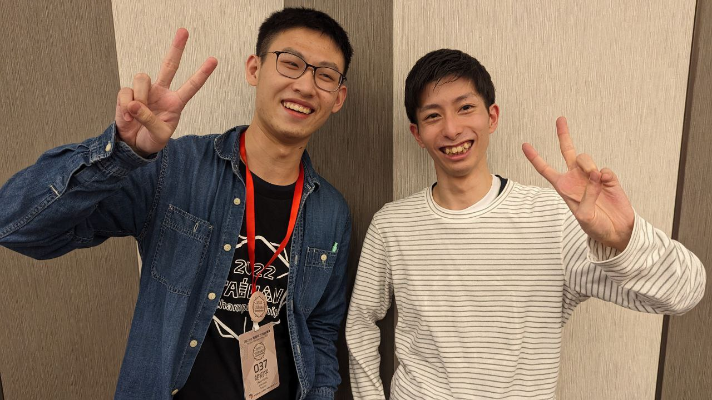

似乎很久沒有發比賽文了，但有點想把過去的事情記錄起來，所以還是讓自己寫一下XD

## 比賽前

其實比賽前一週的狀態是超級淒慘，實習跟學校都有很多 Deadline 很早的事情還沒開始做，再加上這週連續好幾天都在受腸胃炎之苦，如果沒有跟公司請幾天假身體真的要吃不消了QQ
不過剛好到了比賽前把許多工作推了不少進度，肚子也好得差不多了，於是還是興致勃勃地來參加比賽。

## 比賽成績

這次比賽報名了 3x3、2x2、4x4、5x5、Megaminx、和 3x3 OH，不過除了 Megaminx 之外其他都沒有刷 PR，可以說是相當淒慘XD

[我的比賽成績](https://live.worldcubeassociation.org/competitions/1828/competitors/180675)

- Megaminx Single: 1:22.79 → 1:10.08
- Megaminx Average: 1:32.59 → 1:21.63

### 3x3

三階基本上都沒有發揮很好，平均大概比好狀態慢 2 秒左右。大部分在觀察時都只能看到十字，都沒辦法觀察到第一組 pair，真的很可惜。

### 2x2

沒在練習的項目，不過第二輪其實表現還不錯，可惜現在的玩家太強了，想進決賽 sub 4 幾乎不可能XD

### 4x4

第一輪一直遇到 parity 所以很難救，第二輪狀況稍微好一點，但很可惜是有一個 counting 42，所以成績壓不下去。

另外當時有一個特別的狀況是，第二輪有一轉復原到一半時一直看到方塊上有個黑點在飄，停止後發現是被原子筆畫到了，原本想說這轉就算了，就先把痕跡擦掉，但下一轉在觀察時又看到原子筆的新痕跡。我還特別指給我的裁判[薛以和](https://www.worldcubeassociation.org/persons/2016HSUE01)看，先把這次解完之後叫了代表，結果申請到了 extra 之後還是轉出一樣的爛成績XDD

### 5x5

第一輪平均勉強壓在 1:10 多，這一輪除了 1:02 那一轉之外，精神都非常恍惚，外界的聲音感覺很明顯，幾乎無法完全專注在自己的方塊上。

第二輪的前兩轉稍微慢了點，後面就比較進入狀況，其實三把的觀察都算很穩，感覺都有進 60 秒的潛力，希望能早日看到我五階單次 1:00.22 被刷掉XD

### Megaminx

這個項目在賽前已經練到比舊的官方成績快了大概 15 秒，所以單次平均都刷算是在預期之內。唯一很可惜的是後面兩轉都有翻到角，不然基本上平均可以壓在 1:20 內，counting 1:28 真的很傷QQ

另外要特別感謝 [Wayne Pi](https://www.worldcubeassociation.org/persons/2017PIWA01) 近期教我很多 Mega 的小技巧，而且方塊也是跟他借的，站在巨人的肩膀上真的進步比較快(?

[Megaminx Round 1 Average: 1:21.63](https://youtu.be/bGw5-ViJ_7k)

### 3x3 OH

單手完全不在狀態，一直被騰雲的容錯卡到。我懷疑是之前的單次 10.29 詛咒我平均永遠刷不掉QQQQ

## 其他細節

### 比賽工人

這次比賽有報名工作人員（因為我想吃便當），大部分時間都站在檢錄區，幾乎每個玩家的臉都看過了。站在檢錄區看起來沒有跑來跑去，但其實腳很痠，辦比賽真的很辛苦。

三階決賽的時候有幫忙當 Runner，舞台踩的聲音很大，晃來晃去很怕影響到選手XD

### 參賽者

今年的台錦賽除了許多台灣選手，甚至有許多國外的玩家來報名，像是韓國的名將 [Seung Hyuk Nahm](https://www.worldcubeassociation.org/persons/2013NAHM01)，日本的[小林知広](https://www.worldcubeassociation.org/persons/2013KOBA01)、[高岡誠](https://www.worldcubeassociation.org/persons/2013TAKA02)、[平井雅之](https://www.worldcubeassociation.org/persons/2014HIRA05)，還有新加坡 Mega 超強的 [Tristan](https://www.worldcubeassociation.org/persons/2016YONG02) 等等，讓原本水就很深的台灣方塊屆又提升一個黨次。

不得不說韓國大神 [Seung Hyuk Nahm](https://www.worldcubeassociation.org/persons/2013NAHM01) 真的很好聊天，而且英文講得頗標準，很多台灣玩家都跑去跟他聊天。我也有跟日本的[小林知広](https://www.worldcubeassociation.org/persons/2013KOBA01)請教一下東京跟大阪有沒有推薦的景點跟美食（因為下個月要去XD），能跟這些外國選手聊天真的很開心，覺得來參加比賽是值得的XD

### 通勤

週六的早上是搭家人的便車去的，當天回家的時候因為聽到[黃浩宇](https://www.worldcubeassociation.org/persons/2017HUAN05)本來要回基隆，我後來用近距離和「我家有貓咪」說服他住我家，讓他又再次在比魔術方塊比賽買紙內褲(x

隔天週日超級冷，不過是我超級愛的天氣。前一天發現從我家騎車到回家其實只要十多分鐘，比通勤快很多，因此我們 8:00 起床還是有準時到會場，在家附近買早餐也完全來得及。

## 比賽感想

比賽成績其實滿影響心情的，有幾度是心情真的被弄到很不好，不過遇到很多可以互動的玩家心情還是好很多，特別是有許多外國選手的聊天狀況很有趣，整體來講這場比賽還是開心的。

最後還是要感謝一下籌備團隊的人，賽程其實還是挺趕的，也要應付會場各式各樣的狀況，台錦賽應該是台灣的比賽中整體感受最好的了，相對來講只顧檢錄的我算是輕鬆許多。雖然有種台灣方塊圈漸漸飽和的感覺，但反過來說也感受到越來越多人想投入這個圈子，比賽有人幫忙打亂、幫忙拍照等，希望有更多人願意投資在魔術方塊比賽。

搞得好像很隆重，但活動也結束了，又要準備回到生活的正軌了，希望我該忙的東西都能做得完，誒嘿 owob
